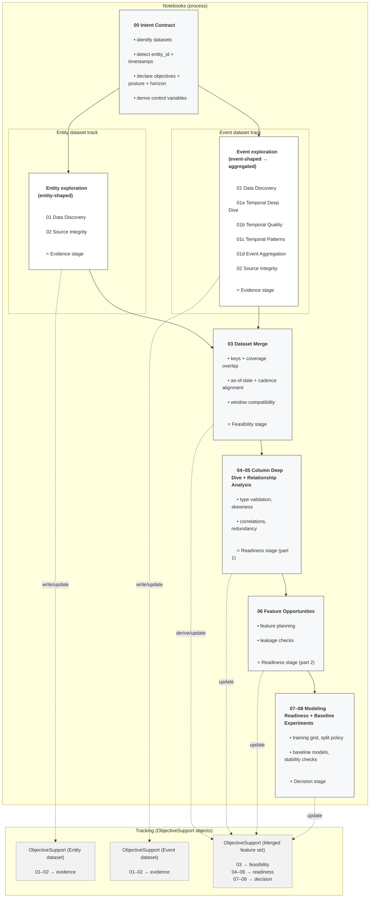

# ObjectiveSupport Lifecycle in the Exploration → Modeling Pipeline

This document shows how the notebook process evolves objective status:

```
evidence → feasibility → readiness → decision
```

…and how we persist this evolution in a small set of **ObjectiveSupport** tracking objects.

---

# Diagram: Two Dataset Tracks + Three Tracking Objects (Mermaid)

Requirements reflected here:

- **Two dataset tracks** in the notebook panel:
  - **Entity dataset track**
  - **Event dataset track**
- **Only three tracking objects** total:
  1) ObjectiveSupport for Entity dataset
  2) ObjectiveSupport for Event dataset
  3) ObjectiveSupport for the **merged feature set**
- Tracking boxes explicitly show the lifecycle evolution (evidence → feasibility → readiness → decision).



---

# ObjectiveSupport YAML (single schema, different scopes)

The same schema supports:
- dataset-level (entity/event)
- merged feature-set level

## Dataset-level ObjectiveSupport (Entity or Event)

```yaml
objective_support:
  scope: dataset
  dataset_id: customer_profile            # or: edi_events
  dataset_kind: entry                     # entry | event
  lifecycle_stage: evidence               # produced by notebooks 01–02

  objectives:
    immediate_risk:
      strength: weak | medium | strong
      confidence: low | medium | high
      signals: {}
      blockers: []

    disengagement:
      strength: weak | medium | strong
      confidence: low | medium | high
      signals: {}
      blockers: []

    renewal_risk:
      strength: weak | medium | strong
      confidence: low | medium | high
      signals: {}
      blockers: []
```

## Merged feature-set ObjectiveSupport

```yaml
objective_support:
  scope: merged_featureset
  modeling_table: weekly_customer_snapshot_v1
  lifecycle_stage: feasibility            # 03 → feasibility, 04-06 → readiness, 07-08 → decision

  datasets_used:
    - customer_profile
    - edi_events

  merge_context:
    cadence: weekly
    as_of_date_strategy: global
    entity_coverage_overlap: 0.87

  objectives:
    immediate_risk:
      strength: medium
      blockers: []
      readiness_score: 0.72               # (populated in 06)
      decision: proceed | defer | reject  # (populated in 07-08)

    disengagement:
      strength: strong
      readiness_score: 0.89
      decision: proceed

    renewal_risk:
      strength: medium
      readiness_score: 0.58
      decision: defer
      blockers:
        - insufficient contract history
```

---

# Notes

- **01–02** are the **Evidence** stage (per dataset). NB01 records objective support via `derive_objective_support()`. NB01a-01c contribute snapshot grid votes. NB02 runs integrity checks.
- **03** is the first place we can truthfully evaluate **Feasibility** (because joining + cadence alignment exist).
- **04–06** upgrade feasible objectives to **Readiness** (feature plan exists, leakage checked).
- **07–08** record the **Decision** based on baseline experiments and stability.
